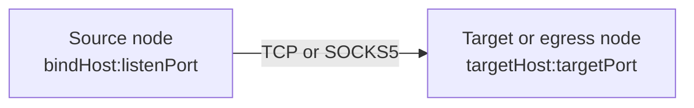
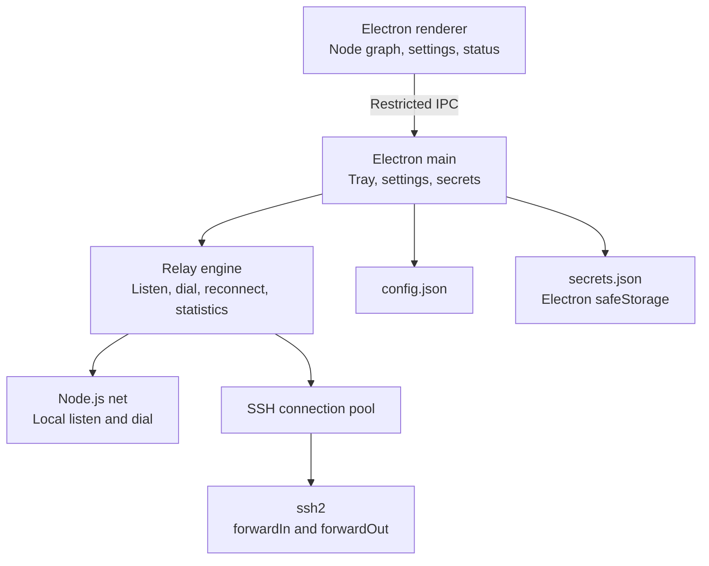

# PortPatch Architecture

## Semantic model

An arrow represents the direction in which network traffic moves. Its source is always a `listen endpoint`, and its destination is always a `dial endpoint`.



Users do not need to translate this model into implementation flags such as `ssh -L` or `ssh -R`.

| Source | Destination | Engine behavior | Conventional meaning |
|---|---|---|---|
| Local computer | Local computer | Local TCP relay | Simple local proxy |
| Local computer | Server B | Local listener plus B `forwardOut` | Local forwarding |
| Server A | Local computer | A `forwardIn` plus local dial | Reverse forwarding |
| Server A | Server B | A `forwardIn` plus B `forwardOut` | Application-relayed server-to-server route |

For SOCKS5 routes, the client CONNECT request supplies the target instead of a fixed destination. The target or egress node opens that connection. A `Server A -> Local computer` SOCKS5 route solves the same class of problem as reverse dynamic forwarding.

## Components



- `src/core/model.js`: configuration normalization, validation, duplicate-listener checks, and loop prevention
- `src/core/connection-manager.js`: SSH authentication, host-key verification, connection reuse, and remote listen/dial operations
- `src/core/relay-engine.js`: route lifecycle, any-to-any stream relay, statistics, and automatic reconnection
- `src/core/socks5.js`: unauthenticated SOCKS5 CONNECT parser
- `src/core/linux-autostart.js`: creates and removes the XDG autostart desktop entry used for launch-at-sign-in on Linux
- `src/main.js`: tray, single-instance handling, IPC, sign-in launch, and storage
- `src/renderer/`: sandboxed renderer and node-graph interface

## Security decisions

- The renderer uses `nodeIntegration: false`, `contextIsolation: true`, and `sandbox: true`.
- The preload exposes only required IPC operations and no arbitrary shell execution.
- SSH connections use the `ssh2` library instead of external commands or `sshpass`.
- The first connection probe sends no credentials and retrieves only the SHA-256 host-key fingerprint. Authentication occurs in a separate connection after the user verifies it. Later connections must match the pinned value exactly.
- Electron `safeStorage` protects passwords and key passphrases with the operating system's native credential store: DPAPI on Windows, Keychain on macOS, and the Secret Service API (GNOME Keyring or KWallet) on Linux. PortPatch does not implement its own encryption or fall back to a bundled key; if no OS-backed store is available it relies on Electron's `basic_text` fallback and surfaces a warning instead of silently treating that as secure.
- Secret records are bound to the server address, port, user, authentication mode, and host-key signature. Configuration and secret files are replaced atomically after their temporary files are synchronized.
- Passwords, passphrases, and private-key fields are removed from logs.
- Listeners bind to loopback by default.
- Non-loopback local listeners and all remote-node listeners require explicit `allowExternal` consent. This is necessary because an SSH server with `GatewayPorts yes` may turn a requested loopback listener into a wildcard listener. The UI adds another warning for unauthenticated SOCKS5 listeners.

On Linux, secure storage depends on the desktop environment's Secret Service or KWallet support. PortPatch does not force a specific backend; it lets Electron/Chromium's own `os_crypt` detection choose between GNOME Keyring (libsecret), KWallet, or the `basic_text` fallback, since that detection already probes for a running Secret Service or KWallet daemon and forcing a backend risks selecting one that is not actually available. GNOME Keyring is the most commonly preinstalled option on mainstream desktop distributions (it ships as a dependency of the GNOME session and unlocks automatically via PAM at login), so most users need no extra setup. The UI warns when Electron reports the insecure `basic_text` backend and suggests installing `gnome-keyring` (or KWallet on KDE).

### The Linux AppImage runs with `--no-sandbox`

electron-builder's stable AppImage toolset (the default; a newer toolset exists only as a beta at the time of writing) adds `--no-sandbox` to the packaged `Exec` line. This is not an oversight: a default (type-2) AppImage is mounted through FUSE at launch, and FUSE mounts are conventionally `nosuid`, so the setuid `chrome-sandbox` helper that Chromium's OS-level process sandbox depends on cannot take effect no matter how its file permissions are set. Passing `--no-sandbox` avoids Chromium refusing to start on systems where the unprivileged-user-namespace fallback is also unavailable (some hardened kernels, containers, and older corporate images disable `CLONE_NEWUSER`) -- confirmed directly in this project's own dev sandbox, where Electron fails with a fatal `setuid_sandbox_host` error unless `--no-sandbox` or `ELECTRON_DISABLE_SANDBOX=1` is set.

This does trade away Chromium's OS-level process sandbox (seccomp/namespace isolation) on Linux. The mitigating factors: the renderer only ever loads PortPatch's own bundled local HTML/JS, never remote or attacker-controlled web content (`setWindowOpenHandler` denies new windows and `will-navigate` is blocked in `src/main.js`); `nodeIntegration: false` and `contextIsolation: true` remain fully in effect regardless of this flag, so a compromised renderer still has no `require()`/Node access; and the preload's IPC surface stays limited to the same whitelisted operations on every platform. Pinning a newer `build.toolsets.appimage` version to re-enable the OS sandbox was deliberately not done here because that toolset is still beta upstream; revisit this once it stabilizes.

### System tray reliability

Electron's Linux `Tray` implementation registers a StatusNotifierItem over D-Bus, which is only rendered if the desktop environment runs a compatible host (KDE and Xfce provide one natively; GNOME requires the "AppIndicator and KStatusNotifierItem Support" extension, which ships pre-installed but disabled-until-first-login on stock Ubuntu, and is not installed at all on stock Fedora/GNOME). When no host is present, `Tray` creation does not throw or log an error -- the icon is simply never rendered anywhere, silently. Verified directly against a real Ubuntu 24.04 GNOME session in this project's dev environment: with the AppIndicator extension not yet active, a built AppImage ran successfully (main, GPU, and renderer processes all up, no crash) but registered no StatusNotifierItem on the session bus at all.

Because `closeToTray` defaults to on and, before this was addressed, the only way to fully quit was the (potentially invisible) tray menu, a user on such a system could hide the window and have no reachable way to quit -- confirmed empirically: after killing the AppImage launcher process, several `portpatch` child processes were still running under its FUSE mount point and had to be force-killed by pattern match, since there was no window, dock entry, or visible tray icon left to close them from. `src/renderer/index.html`/`app.js` now expose an always-visible power-icon "Quit" button in the topbar (`#quit-button`, confirmed via the existing `window.confirm` pattern) so quitting never depends on tray visibility. This is a platform-independent fix, not a Linux-only patch, since the same gap could occur on any platform if the tray icon is hidden in an overflow area.

## Linux autostart

Electron's `app.setLoginItemSettings` API only supports Windows and macOS. On Linux, `applyLoginSetting` in `src/main.js` instead calls `setLinuxAutostart` (`src/core/linux-autostart.js`), which writes or removes a `Type=Application` desktop entry at `~/.config/autostart/io.github.plainpacket.portpatch.desktop` per the [XDG Desktop Entry Specification](https://specifications.freedesktop.org/desktop-entry-spec/latest/). The entry's `Exec` value is quoted according to that specification's own tokenizer rules; it is never passed through a shell, so there is no shell-injection surface even for executable paths containing spaces or special characters. The file is written atomically and enabling/disabling autostart is driven by the same `startWithSystem`/`launchHidden` settings used on Windows, so the renderer needs no platform-specific logic beyond removing the Windows-only disabled state.

## Reconnection

A route moves through `idle -> starting -> running`. If a required SSH connection or remote listener closes, the engine clears related streams and retries after `1, 2, 4, 8, 16, and 30 seconds`. A manual stop also cancels pending retries.

## Storage and portability

The executable is portable, but mutable user data is stored in Electron's per-user `userData` directory. `config.json` stores configuration, while `secrets.json` stores only encrypted bytes. This separation avoids write-permission failures when the executable is moved to a read-only directory and prevents credentials from being carried accidentally with the executable.

```json
{
  "version": 1,
  "servers": [],
  "routes": [
    {
      "id": "route-id",
      "name": "GPU LLM API",
      "protocol": "tcp",
      "source": { "nodeId": "local", "bindHost": "127.0.0.1", "port": 18000 },
      "target": { "nodeId": "gpu-server", "host": "127.0.0.1", "port": 8000 },
      "reconnect": true,
      "allowExternal": false
    }
  ]
}
