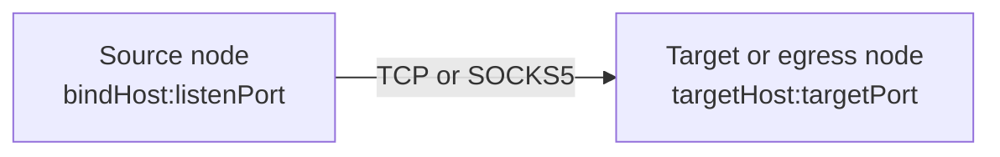
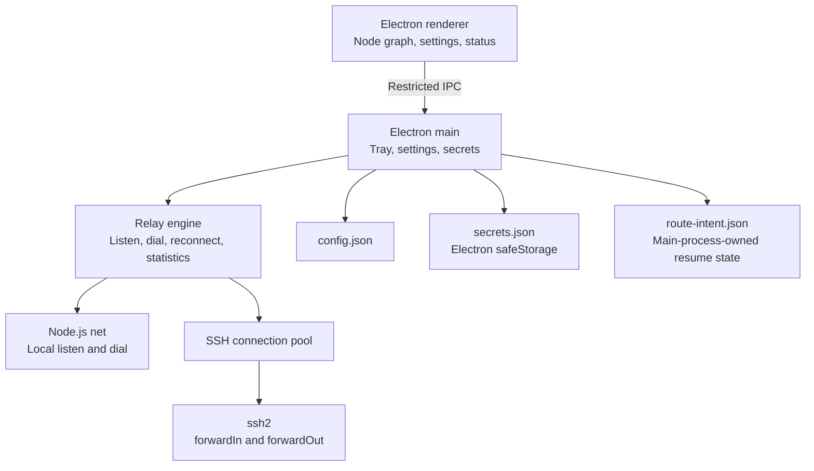

# PortPatch Architecture

## Semantic model

An arrow represents the direction in which network traffic moves. Its source is always a `listen endpoint`, and its destination is always a `dial endpoint`.



Users do not need to translate this model into implementation flags such as `ssh -L` or `ssh -R`.

| Source | Destination | Engine behavior | Conventional meaning |
|---|---|---|---|
| Local computer | Local computer | Local TCP relay | Simple local proxy |
| Local computer | Server B | Local listener plus B `forwardOut` | Local forwarding |
| Server A | Local computer | A `forwardIn` plus local dial | Reverse forwarding |
| Server A | Server B | A `forwardIn` plus B `forwardOut` | Application-relayed server-to-server route |

For SOCKS5 routes, the client CONNECT request supplies the target instead of a fixed destination. The target or egress node opens that connection. A `Server A -> Local computer` SOCKS5 route solves the same class of problem as reverse dynamic forwarding.

## Components



- `src/core/model.js`: configuration normalization, validation, duplicate-listener checks, and loop prevention
- `src/core/connection-manager.js`: SSH authentication, host-key verification, connection reuse, and remote listen/dial operations
- `src/core/relay-engine.js`: route lifecycle, any-to-any stream relay, statistics, and automatic reconnection
- `src/core/socks5.js`: unauthenticated SOCKS5 CONNECT parser
- `src/core/linux-autostart.js`: creates and removes the XDG autostart desktop entry used for launch-at-sign-in on Linux
- `src/core/route-intent-store.js`: atomically persists the IDs of explicitly active routes without exposing that state to renderer-supplied configuration
- `src/main.js`: tray, single-instance handling, IPC, sign-in launch, and storage
- `src/renderer/`: sandboxed renderer and node-graph interface

## Security decisions

- The renderer uses `nodeIntegration: false`, `contextIsolation: true`, and `sandbox: true`.
- The preload exposes only required IPC operations and no arbitrary shell execution.
- SSH connections use the `ssh2` library instead of external commands or `sshpass`.
- The first connection probe sends no credentials and retrieves only the SHA-256 host-key fingerprint. Authentication occurs in a separate connection after the user verifies it. Later connections must match the pinned value exactly.
- Electron `safeStorage` protects passwords and key passphrases with the operating system's native credential store: DPAPI on Windows, Keychain on macOS, and the Secret Service API (GNOME Keyring or KWallet) on Linux. PortPatch does not implement its own encryption or fall back to a bundled key. If Electron selects the insecure Linux `basic_text` backend, new password and passphrase persistence is blocked.
- Secret records are bound to the server address, port, user, authentication mode, and host-key signature. Configuration and secret files are replaced atomically after their temporary files are synchronized.
- Passwords, passphrases, and private-key fields are removed from logs.
- Listeners bind to loopback by default.
- Non-loopback local listeners and all remote-node listeners require explicit `allowExternal` consent. This is necessary because an SSH server with `GatewayPorts yes` may turn a requested loopback listener into a wildcard listener. The UI adds another warning for unauthenticated SOCKS5 listeners.

On Linux, secure storage depends on the desktop environment's Secret Service or KWallet support. PortPatch does not force a specific backend; it lets Electron/Chromium's own `os_crypt` detection choose between GNOME Keyring (libsecret), KWallet, or the `basic_text` fallback, since that detection already probes for a running Secret Service or KWallet daemon and forcing a backend risks selecting one that is not actually available. GNOME Keyring is the most commonly preinstalled option on mainstream desktop distributions (it ships as a dependency of the GNOME session and unlocks automatically via PAM at login), so most users need no extra setup. If Electron reports `basic_text`, the UI explains that new password/passphrase persistence is blocked and recommends installing `gnome-keyring` (or KWallet) or using SSH Agent authentication.

### The Linux AppImage runs with `--no-sandbox`

electron-builder's stable AppImage toolset adds `--no-sandbox` to the packaged `Exec` line. A type-2 AppImage is mounted through FUSE, normally with `nosuid`, so Chromium's setuid sandbox helper cannot operate from that mount. The flag also permits startup on systems where unprivileged user namespaces are unavailable.

This removes Chromium's OS-level renderer sandbox on Linux. PortPatch reduces the exposed surface by loading only bundled local content, denying navigation and new windows, keeping `nodeIntegration` disabled, retaining context isolation, and limiting preload IPC. AppImage sandbox support should be revisited when the stable packaging toolchain can provide it.

### System tray reliability

Electron's Linux `Tray` implementation requires a compatible StatusNotifierItem host. KDE and Xfce normally provide one; GNOME commonly requires the "AppIndicator and KStatusNotifierItem Support" extension. If no host is available, Electron may create the tray object without displaying an icon.

The top bar therefore provides an explicit Quit button, and launching the same executable again focuses the existing single instance. Neither reopening nor quitting depends exclusively on tray visibility.

## Linux autostart

Electron's `app.setLoginItemSettings` API only supports Windows and macOS. On Linux, `applyLoginSetting` in `src/main.js` instead calls `setLinuxAutostart` (`src/core/linux-autostart.js`), which writes or removes a `Type=Application` desktop entry per the [XDG Desktop Entry Specification](https://specifications.freedesktop.org/desktop-entry-spec/latest/), at `$XDG_CONFIG_HOME/autostart/io.github.plainpacket.portpatch.desktop` if that variable is set, or `~/.config/autostart/...` otherwise (per the [XDG Base Directory Specification](https://specifications.freedesktop.org/basedir-spec/basedir-spec-latest.html)). The entry's `Exec` value is quoted according to the Desktop Entry Specification's own tokenizer rules; it is never passed through a shell, so there is no shell-injection surface even for executable paths containing spaces or special characters. The file is written atomically and enabling/disabling autostart is driven by the same `startWithSystem`/`launchHidden` settings used on Windows, so the renderer needs no platform-specific logic beyond removing the Windows-only disabled state.

The executable path comes from `resolveLinuxExecutablePath()`, which prefers `process.env.APPIMAGE` over `process.execPath`. The former points to the persistent AppImage file, while the latter can point inside a temporary FUSE mount that disappears after exit.

## Route restoration

Route restoration is an explicit, off-by-default setting shared by Windows and Linux. `route-intent.json` is owned by the main process and contains only route IDs that the user started; it does not contain endpoints or credentials. Starting a route records intent before connection begins so that an explicitly requested route remains eligible after a transient initial failure. A manual stop removes that intent before closing the listener, while application shutdown deliberately preserves it. At the next launch, PortPatch validates the complete stored configuration, removes IDs for deleted routes, and restores only the remaining saved IDs. Existing exposure consent and host-key checks still apply.

This design fails closed: corrupt state restores nothing, a new installation restores nothing, disabling the setting clears saved intent, and failure to persist intent prevents a route from starting. Recorded routes that enter their configured reconnection loop remain eligible for restoration.

## Reconnection

A route moves through `idle -> starting -> running`. If a required SSH connection or remote listener closes, the engine clears related streams and retries after `1, 2, 4, 8, 16, and 30 seconds`. A manual stop also cancels pending retries.

## Storage and portability

The executable is portable, but mutable user data is stored in Electron's per-user `userData` directory. `config.json` stores configuration, `route-intent.json` stores only opted-in route IDs for restoration, and `secrets.json` stores only encrypted bytes. This separation avoids write-permission failures when the executable is moved to a read-only directory and prevents credentials from being carried accidentally with the executable.

```json
{
  "version": 1,
  "servers": [],
  "routes": [
    {
      "id": "route-id",
      "name": "GPU LLM API",
      "protocol": "tcp",
      "source": { "nodeId": "local", "bindHost": "127.0.0.1", "port": 18000 },
      "target": { "nodeId": "gpu-server", "host": "127.0.0.1", "port": 8000 },
      "reconnect": true,
      "allowExternal": false
    }
  ]
}
