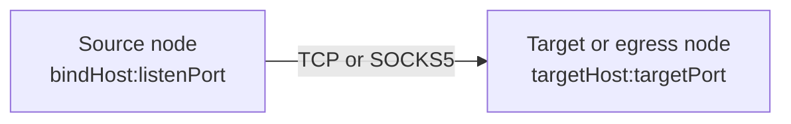
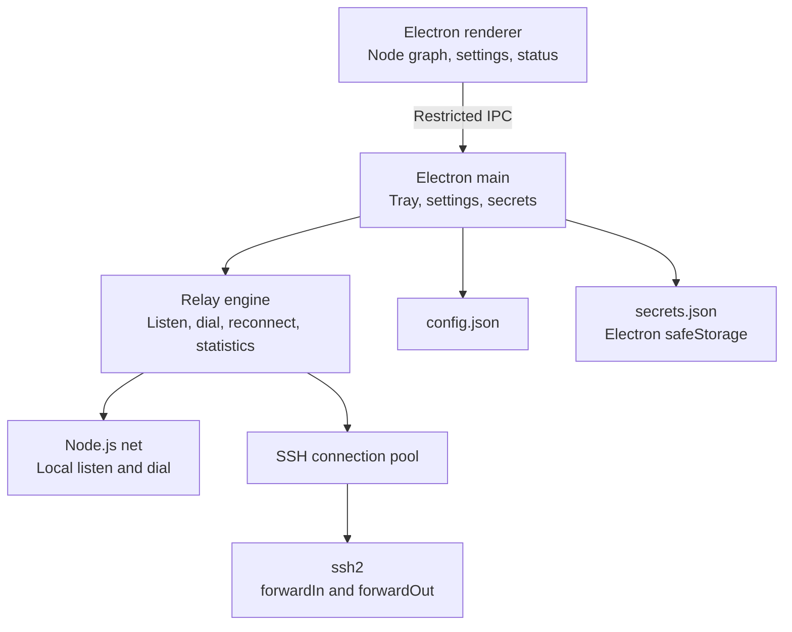

# PortPatch Architecture

## Semantic model

An arrow represents the direction in which network traffic moves. Its source is always a `listen endpoint`, and its destination is always a `dial endpoint`.



Users do not need to translate this model into implementation flags such as `ssh -L` or `ssh -R`.

| Source | Destination | Engine behavior | Conventional meaning |
|---|---|---|---|
| Local computer | Local computer | Local TCP relay | Simple local proxy |
| Local computer | Server B | Local listener plus B `forwardOut` | Local forwarding |
| Server A | Local computer | A `forwardIn` plus local dial | Reverse forwarding |
| Server A | Server B | A `forwardIn` plus B `forwardOut` | Application-relayed server-to-server route |

For SOCKS5 routes, the client CONNECT request supplies the target instead of a fixed destination. The target or egress node opens that connection. A `Server A -> Local computer` SOCKS5 route solves the same class of problem as reverse dynamic forwarding.

## Components



- `src/core/model.js`: configuration normalization, validation, duplicate-listener checks, and loop prevention
- `src/core/connection-manager.js`: SSH authentication, host-key verification, connection reuse, and remote listen/dial operations
- `src/core/relay-engine.js`: route lifecycle, any-to-any stream relay, statistics, and automatic reconnection
- `src/core/socks5.js`: unauthenticated SOCKS5 CONNECT parser
- `src/main.js`: tray, single-instance handling, IPC, sign-in launch, and storage
- `src/renderer/`: sandboxed renderer and node-graph interface

## Security decisions

- The renderer uses `nodeIntegration: false`, `contextIsolation: true`, and `sandbox: true`.
- The preload exposes only required IPC operations and no arbitrary shell execution.
- SSH connections use the `ssh2` library instead of external commands or `sshpass`.
- The first connection probe sends no credentials and retrieves only the SHA-256 host-key fingerprint. Authentication occurs in a separate connection after the user verifies it. Later connections must match the pinned value exactly.
- On Windows, Electron `safeStorage` protects passwords and key passphrases with DPAPI.
- Secret records are bound to the server address, port, user, authentication mode, and host-key signature. Configuration and secret files are replaced atomically after their temporary files are synchronized.
- Passwords, passphrases, and private-key fields are removed from logs.
- Listeners bind to loopback by default.
- Non-loopback local listeners and all remote-node listeners require explicit `allowExternal` consent. This is necessary because an SSH server with `GatewayPorts yes` may turn a requested loopback listener into a wildcard listener. The UI adds another warning for unauthenticated SOCKS5 listeners.

On Linux, secure storage depends on the desktop environment's Secret Service or KWallet support. The UI warns when Electron reports the insecure `basic_text` backend.

## Reconnection

A route moves through `idle -> starting -> running`. If a required SSH connection or remote listener closes, the engine clears related streams and retries after `1, 2, 4, 8, 16, and 30 seconds`. A manual stop also cancels pending retries.

## Storage and portability

The executable is portable, but mutable user data is stored in Electron's per-user `userData` directory. `config.json` stores configuration, while `secrets.json` stores only encrypted bytes. This separation avoids write-permission failures when the executable is moved to a read-only directory and prevents credentials from being carried accidentally with the executable.

```json
{
  "version": 1,
  "servers": [],
  "routes": [
    {
      "id": "route-id",
      "name": "GPU LLM API",
      "protocol": "tcp",
      "source": { "nodeId": "local", "bindHost": "127.0.0.1", "port": 18000 },
      "target": { "nodeId": "gpu-server", "host": "127.0.0.1", "port": 8000 },
      "reconnect": true,
      "allowExternal": false
    }
  ]
}
